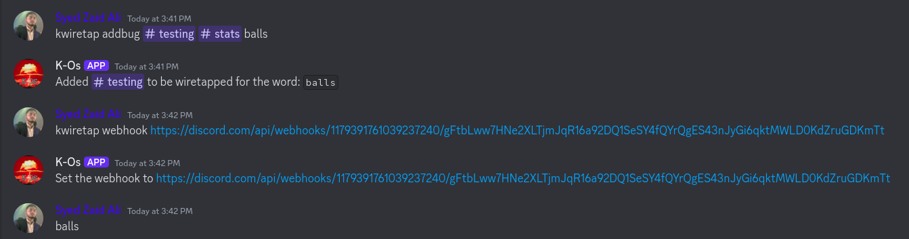
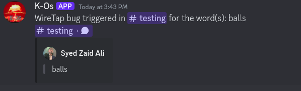

# WireTap

A cog that lets you "spy" in on a channel based on trigger words.

To use the cog, you need to set the channel you want to spy on, along with the channel where the alerts will be sent.

There is no global alert channel so you can have a separate one for each trigger word in each channel.

`[p]wiretap addbug <channel> <alertchannel> <triggerword>` will add a trigger word to the list.

`[p]wiretap delbug <channel> <triggerword>` will remove a trigger word from the list.

`[p]wiretap listbugs` will list all the trigger words you have set up.

`[p]wiretap webhook <link>` will set the webhook that will be used to send the alert messages.

 

 Setting a webhook is optional. With it, the alerts will look as if the user himself sent the message:
 

Without it, the alerts will be sent as the bot:
